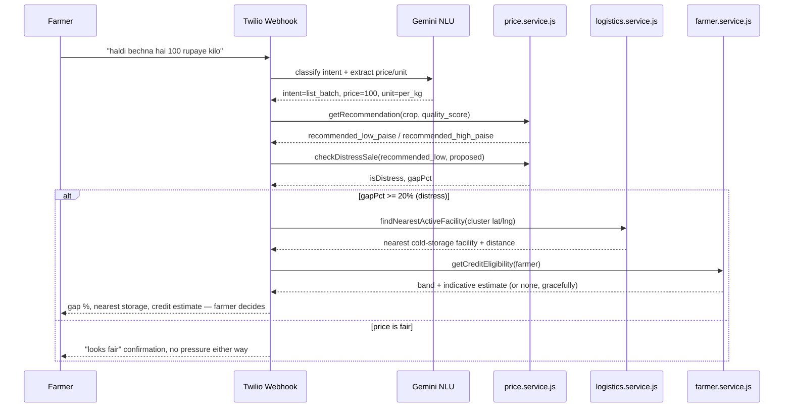
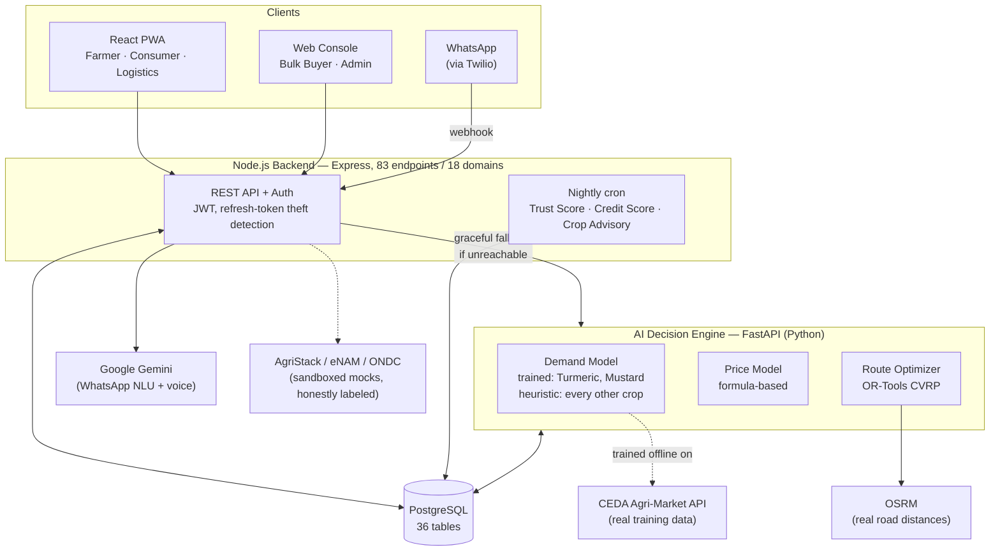
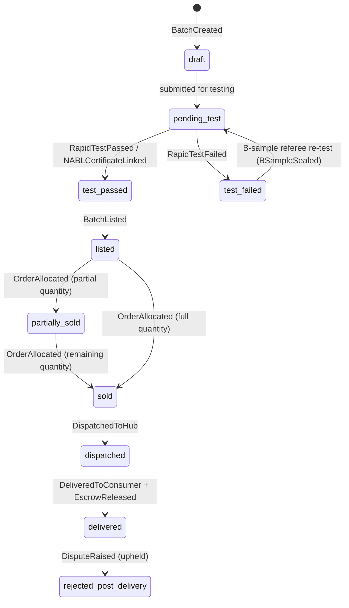
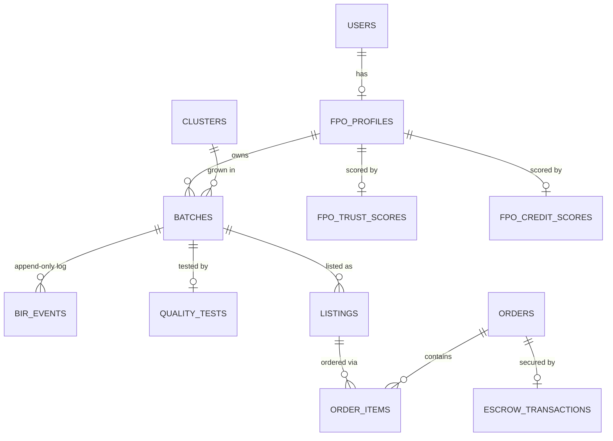

# BharatPure

**India's Farm-to-Market Trust Network — every batch verified, every price fair.**

> Smart India Hackathon 2026 · Problem Statement **SIH26033** · Ministry of Consumer Affairs, Food & Public Distribution (Department of Consumer Affairs) · Software Edition — Agriculture, FoodTech & Rural Development

[](docs/testing/full-regression-newman-2026-09-17f.txt)
[](backend/src/routes)
[](backend/src/db/migrations)
[](ai/models/demand_model.py)
[](LICENSE)

> **⚠️ Proprietary — All Rights Reserved.** This repository is public for SIH 2026 evaluation only. No license is granted to copy, reuse, or redistribute any part of it. See [`LICENSE`](LICENSE).

---

## The problem this solves

> **"Multiple intermediaries reduce farmers' earnings and increase consumer prices."**
> — SIH26033, sponsored by the Ministry of Consumer Affairs, Food & Public Distribution

A farmer sells turmeric at the village mandi for ₹140/kg. Three intermediaries later — a local trader, a wholesaler, a retailer's distributor — a consumer in Delhi pays ₹280/kg for the same turmeric with no idea who grew it, whether it's actually pure, or whether the farmer saw a fair share of that price. The Ministry's own stated 2025–2026 priority is exactly this: monitoring the wholesale-to-retail margin gap and — through a ₹1 lakh crore cooperative grain storage plan — explicitly preventing farmers from being forced into **distress sales** just to survive a cash crunch.

BharatPure is a working answer to that problem statement: not a slide deck, not a Figma mockup — a real, running, end-to-end platform with a Postgres-backed backend, a real trained AI demand-forecasting model, and a Hindi/Hinglish/English WhatsApp bot, verified live at every layer.

---

## What BharatPure actually is

BharatPure is not just a marketplace app. It's built around four pillars — the same four pillars used internally to scope every feature added to this repo:

| Pillar | What it means here |
|---|---|
| **Decision Engine** | A FastAPI AI service that predicts crop demand, computes fair prices from verified quality + live market rates, matches FPO supply to buyer demand, and solves real vehicle-routing problems (OR-Tools CVRP over real road distances, not straight-line guesses). |
| **Trust Layer** | Every batch carries an immutable, append-only **Batch Identity Record (BIR)** — 22 real event types from harvest through NABL lab testing to QR burn on delivery. Nothing is ever updated in place; corrections are new events, not edits. |
| **Open Commerce** | An ONDC-compatible seller-network shape and an AgriStack-ready identity model — consumed as government rails, not replaced with a proprietary walled garden. Where a real integration isn't available yet, the mock is labeled `sandbox`/`mock` in the API response itself, never presented as live. |
| **Accessible Interface** | An installable, offline-capable PWA for farmers, consumers, and logistics staff; a web console for buyers and government admins; and a WhatsApp bot (Gemini-powered NLU, with a full rule-based fallback) for farmers who will never open an app at all. |

---

## What's actually built (not planned — built and verified live)

Every item below has been exercised against the real running database and HTTP server this session, not just written and assumed correct. See [Testing & verification discipline](#testing--verification-discipline) for how that claim is backed up.

### For farmers
- **Batch lifecycle**: create → quality test (rapid Tier-1 or NABL-accredited Tier-2) → certificate upload → listing → sale → escrow release, each step a real BIR event.
- **Real AI-trained demand forecasting** for Turmeric and Mustard — not a heuristic. Three `HistGradientBoostingRegressor` quantile models (p10/p50/p90) per crop, trained on real historical arrivals/price data pulled directly from CEDA (Ashoka University)'s Agri-Market API. Every other crop falls back to a documented, formula-based heuristic — the two are never conflated, and the model version returned by the API (`agmarknet-hgbr-v1` vs `heuristic-v1`) tells you honestly which one answered.
- **AI price recommendation** with a live commodity-rate comparison, quality-tier premium, and buyer-acceptance probability.
- **Distress Sale Shield** *(flagship feature — see below)*.
- **Gamified Trust Score** — a Bronze → Silver → Gold → Platinum tier computed from the same real fulfillment/quality/dispute metrics that drive credit eligibility, a quality-pass streak, and achievement badges — every value derived from a real field, nothing invented for show.
- **Micro-Credit Eligibility Score** — HIGH/MEDIUM/LOW bands (or an honest `INSUFFICIENT_DATA` below 5 batches) from trust score, payment reliability, batch volume, and dispute rate, always framed as an indicative signal, never as a loan offer.
- **Impact Receipt** — after a batch sells, a real ₹-uplift comparison against the traditional mandi rate for that exact settlement, not a hypothetical.
- **Next-Season Crop Advisory** — a nightly job turns the demand forecast into an INCREASE/MAINTAIN/DECREASE recommendation per growing cluster.
- **WhatsApp-native** — price/demand/batch-status queries and full batch listing, in Hindi, Hinglish, or English, including voice-note support (Gemini transcribes and classifies in one call).

### For consumers & bulk buyers
- **QR-verified provenance** — scan a batch's QR code to see its full farm-to-fork BIR timeline (icons per event, real staggered timestamps, not everything stamped in the same second), then "burn" the code on opening to make reuse/counterfeiting provably impossible.
- **Zero-commission transparency** — every listing shows the real FPO/farmer, a live quality-score bar, and states plainly that the farmer receives the full listed price (checked against the actual escrow-release code path, not asserted).
- **Escrow-protected checkout** — payment held until delivery is confirmed, released automatically, no manual intervention.
- **Bulk procurement console** — catalog browsing, FPO trust-score visibility, and bulk order placement for institutional buyers.

### For logistics & government
- **Real road-distance routing** — OSRM's public Table API for the actual distance matrix, with an automatic Haversine fallback if OSRM is unreachable (verified both paths independently, not assumed).
- **Cold-chain breach auto-reroute** — a temperature breach on an active route automatically splices in the nearest cold-storage facility as the next stop and blocks final delivery until the hold is cleared by a driver action — a real state-machine, not a notification that goes nowhere.
- **Admin command center** — Intermediation Efficiency Index (IEI), FPO/batch management, escrow oversight, DPI integration status (each rail honestly labeled live/mock), audit log, and a what-if pricing/demand simulator.

---

## Flagship: the Distress Sale Shield

The single feature this project is built around, because it maps directly onto the sponsoring Ministry's own stated 2025–2026 priority — not a generic "AI recommendation," a specific policy hook: the government's own ₹1 lakh crore World's Largest Grain Storage Plan explicitly states its goal as *"preventing distress sale of crops and enabling farmers to realise better prices."*

**How it works:** when a farmer messages the WhatsApp bot to list a batch at a price ≥20% below the AI's fair-market recommendation, the bot doesn't just record the price — it intervenes. It shows the real recommended range and the gap, looks up the nearest active cold-storage facility so the farmer can hold the produce instead of selling at a loss, and — when the farmer's credit history supports it — surfaces an indicative micro-credit estimate to bridge the cash gap, clearly labeled as an estimate, never as a loan offer.

This ties three things that already existed independently (AI price recommendation, the cold-storage facility network built for cold-chain auto-reroute, and the Micro-Credit Eligibility Score) into one coherent WhatsApp moment — no new infrastructure, no new external dependency, 100% demo-able live on a phone.



*(Every box in this diagram is real, shipped code — `whatsapp.service.js`'s `list_batch` branch, `price.service.js#checkDistressSale`, `logistics.service.js#findNearestActiveFacility`, `farmer.service.js#getCreditEligibility` — not a conceptual sketch.)*

---

## How BharatPure compares

| Platform | Sector | AI demand & pricing | Consumer provenance trust | Auto-rerouting logistics | WhatsApp-native commerce |
|---|---|:---:|:---:|:---:|:---:|
| **BharatPure** | This project | ✅ Trained model | ✅ Immutable BIR + QR burn | ✅ Dynamic OR-Tools rerouting | ✅ Full transactions, not just chat |
| eNAM | Govt. (Central) | ❌ Auction only | ❌ Mandi-level only | ❌ Static | ❌ Portal-based |
| AgriStack | Govt. (Central) | ❌ Identity infra only | — | — | — |
| ONDC Agriculture | Govt. (Central) | ❌ Protocol layer | ❌ Left to participants | ❌ Delegated | ❌ Protocol layer |
| Ninjacart | Private | ✅ Internal forecasting | ❌ B2B warehouse only | ✅ Internal only | ✅ Advisory bots |
| DeHaat | Private | ⚠️ Yield prediction only | ⚠️ Private-label only | ❌ Static hub-and-spoke | ✅ Omnichannel |
| KisanKonnect | Private | ⚠️ Partial | ⚠️ App-level, closed | ❌ | ✅ Started via WhatsApp |
| ITC e-Choupal | Private | ✅ Astra sourcing AI | ❌ Corporate QC only | ✅ Large-scale procurement | ✅ Gen-AI advisory |

*(Full comparison including Karnataka ReMS, MP e-Uparjan, WayCool, AgroStar, and Arya.ag: [`docs/research/platform-comparison-consolidated.md`](docs/research/platform-comparison-consolidated.md).)*

**What actually makes this different, not just "more features":**

1. **Open, not walled.** Private players like Ninjacart and WayCool hoard demand data to protect their own margins — they *are* the new intermediary. BharatPure's ONDC-compatible shape is built so an FPO's AI demand forecast travels with them into an open network, not locked inside one company's app.
2. **Portable trust, not platform-locked trust.** KisanKonnect's traceability is a feature of KisanKonnect — leave the platform, lose the reputation. BharatPure's BIR is an event-sourced, append-only ledger that belongs to the batch, not to the marketplace that happened to sell it.
3. **Actionable, not just advisory, WhatsApp.** AgroStar and ITC e-Choupal offer WhatsApp *advice*. BharatPure runs the actual transaction — listing, pricing, distress-sale intervention — over WhatsApp, because a low-literacy farmer who will never install an app can still fully participate.
4. **Honest about what's real.** Every AgriStack/eNAM/ONDC integration in this codebase is labeled `sandbox`/`mock` in its own API response when it is one. Nothing here claims a live government integration that doesn't exist — which is exactly the kind of scrutiny SIH's technical-depth judging rewards, and exactly what breaks under a live demo if you fake it.

---

## Built to survive the live demo, not just the pitch deck

SIH's own published judging criteria (novelty, feasibility, technical depth, UX, scale of impact — no single official percentage weighting is publicly documented, and this README won't pretend one is) consistently reward one thing above all in the Grand Finale: **a real, working, live demo**, not a mockup walkthrough. Recent winning teams (e.g. SIH 2025's Most Outstanding Team, AntarDrishti) won on exactly that pattern — a deployable product a judge could actually touch.

That's the bar this repo is held to:

- **189/189 Postman regression assertions passing**, re-run after every backend-touching change this entire build — not a number frozen at project start.
- **A real seeded database** with `npm run db:reset` restoring a clean, demo-ready state in under a second, so a botched live demo run is never more than one command away from a fresh start.
- **Every AI-proxying route has a tested "AI service is down" path** — because a live demo failing gracefully is the difference between a hiccup and a disaster.
- **Two real trained ML models**, not a synthetic dataset dressed up to look trained (an early automated attempt at this *did* fabricate training data — caught, rejected, and redone with genuinely pulled CEDA data; see `chatbot.md` Phase 7 for the full record, kept rather than hidden).

---

## Architecture

```
BharatPure/
├── backend/     Node.js 24 · Express 4 · PostgreSQL — REST API, auth, escrow, BIR event log
├── ai/          Python 3.14 · FastAPI · OR-Tools · scikit-learn — Decision Engine microservice
├── frontend/    React 19 · Vite 8 · Tailwind v4 · TanStack Query — PWA + web console, 49 screens
├── design/      Design system + Stitch-generated screen references
└── docs/        Research, testing logs, API/DB/UI specifications
```

Three independently-runnable services, one shared Postgres database. The Node backend never calls the AI service synchronously for anything a farmer is blocked on — every AI-dependent route has a documented, tested fallback (a formula-replicated price calculation, a cached-or-null demand read) so the AI service being down degrades functionality, never crashes it.

### System architecture



### Batch lifecycle — event-sourced, not a mutable status field

Every transition below fires a real, append-only **BIR event** (22 types total) rather than just flipping a column — the log is the source of truth, `batches.status` is a derived convenience field.



### Core data model (simplified)

The real schema is 36 tables; this is the subset that carries the money and the trust:



### Tech stack

| Layer | Technology |
|---|---|
| Backend | Node.js 24, Express 4, PostgreSQL (`pg`), `node-pg-migrate` (37 migrations → 36 tables), Zod validation, JWT auth with refresh-token theft detection, `node-cron` nightly jobs |
| AI / Decision Engine | Python 3.14, FastAPI, Google OR-Tools (real CVRP solver for routing), scikit-learn `HistGradientBoostingRegressor` (quantile regression for demand), OSRM (real road-distance routing) |
| Frontend | React 19, Vite 8, TypeScript, Tailwind CSS v4, shadcn/ui, TanStack Query, Zustand (persisted stores), React Hook Form + Zod, Recharts |
| Messaging | Twilio WhatsApp Business API, Google Gemini (`gemini-3.6-flash`) for NLU + voice-note transcription, with a full rule-based local fallback when no API key is configured |
| Infra | PWA (installable, offline-capable, Workbox runtime caching, 120 precached entries), code-split React bundle (`React.lazy` per route — main chunk 494KB / 162KB gzipped, heavy pages like the QR scanner and charts load on demand) |

---

## By the numbers

| | |
|---|---|
| PostgreSQL tables | 36 (37 migrations) |
| REST API endpoints | 83, across 18 route domains |
| Frontend screens | 49, across 5 roles (Farmer, Consumer, Bulk Buyer, Logistics, Admin) |
| BIR event types | 22, covering the full harvest-to-delivery lifecycle |
| Crops with real trained AI models | 2 (Turmeric, Mustard) — trained on 2,131 and 4,122 real rows respectively, pulled live from CEDA's Agri-Market API |
| Backend regression suite | 189/189 assertions passing |
| Roles supported | Farmer/FPO, Consumer, Bulk Buyer, Logistics driver, Government Admin |

---

## Notable engineering decisions

The kind of detail that only shows up if someone actually reads the code, not just the pitch:

- **Race-condition-safe stock deduction, not a `SELECT` then `UPDATE`.** Placing an order does a single conditional `UPDATE batches SET remaining_quantity_kg = remaining_quantity_kg - $qty WHERE id = $id AND remaining_quantity_kg >= $qty` inside the escrow transaction — zero rows updated means insufficient stock, atomically, with no separate lock step and no window for two simultaneous buyers to both "win" the last of a batch. Verified with a real concurrency test: two genuinely simultaneous requests for the last available quantity, not two sequential ones — one gets `201`, one gets `409 INSUFFICIENT_STOCK`, exactly one order exists afterward.
- **Refresh-token theft detection, not just expiry.** Every refresh token is single-use and rotates on refresh. If an already-*revoked* token is presented again — the signature of a stolen, replayed token — every other active session for that user is revoked immediately, forcing a full re-login everywhere, not just silently rejecting the one request.
- **Hybrid AI dispatch that tells you which model answered.** `demand_model.py` tries a real trained model first (`TRAINED_CROPS = ("TURMERIC", "MUSTARD")`) and only falls through to the heuristic when no trained artifact exists for that crop — and the API response's `model_version` field (`agmarknet-hgbr-v1` vs `heuristic-v1`) makes that distinction visible to the caller instead of quietly blending real predictions with guesses.
- **AI-outage-first design, not AI-outage-as-afterthought.** Every route that touches the AI service was built and tested against the AI service being *down* before being tested against it being up — price recommendation replicates the exact same formula in Node as a fallback, demand forecasting degrades to a cached-or-null read rather than blocking. A live demo where the AI microservice hiccups degrades, it doesn't 500.
- **Append-only trust, enforced at the schema level.** `bir_events` has no `updated_at` or `deleted_at` column at all, on purpose — corrections are new rows, never edits, so the audit trail can't be quietly rewritten even by a bug.

---

## Getting started

Requires **Node.js 24+**, **Python 3.14+**, and a local **PostgreSQL** instance.

```bash
# 1. Database
createdb bharatpure_dev
cd backend
npm install
# create backend/.env — see Environment variables below
npm run migrate:up      # runs all 37 migrations
npm run db:seed         # seeds 3 FPOs, 6 batches, cold storage facilities, demand forecasts
npm start                # → http://localhost:5000

# 2. AI Decision Engine (separate terminal)
cd ai
python -m venv .venv && .venv/Scripts/activate   # or source .venv/bin/activate on macOS/Linux
pip install -r requirements.txt
uvicorn main:app --port 8000   # → http://localhost:8000

# 3. Frontend (separate terminal)
cd frontend
npm install
npm run dev              # → http://localhost:5173
```

After seeding, every seeded account uses the password `Test@1234` (logged to the console on seed). To reset to a clean demo state at any point — including after running the test suite, which mutates real rows — run `npm run db:reset` from `backend/`.

### Environment variables (`backend/.env`)

| Variable | Required | Notes |
|---|---|---|
| `DATABASE_URL` | Yes | Shared with the AI service |
| `JWT_ACCESS_SECRET` / `JWT_REFRESH_SECRET` | Yes | Any strong random string in dev |
| `QR_SECRET` | Yes | HMAC key for QR hash generation |
| `PORT` | No | Defaults to 5000 |
| `AI_SERVICE_URL` | No | Defaults to `http://localhost:8000`; every route degrades gracefully if unset/unreachable |
| `GEMINI_API_KEY` | No | Without it, the WhatsApp bot runs on its rule-based Hindi/Hinglish/English fallback instead of Gemini NLU |
| `TWILIO_ACCOUNT_SID` / `TWILIO_AUTH_TOKEN` | No | Required only for real WhatsApp delivery + voice-note media fetch |
| `ADMIN_REGISTRATION_CODE` | Yes | Gate for self-service admin account creation |

`ai/.env` needs only `DATABASE_URL` (same database).

---

## Testing & verification discipline

```bash
cd backend
npx newman run postman/-collection.json -e postman/-environment.json --delay-request 650
```

189 assertions across every domain — auth, batches, quality, listings, orders/escrow, QR, disputes, logistics, admin, DPI, WhatsApp webhook. `--delay-request` is required: the collection's ~116 requests otherwise outrun this project's own API rate limiter within a single run and produce false failures that look like regressions but aren't.

This suite is re-run after every backend-touching change in this repo's history, not maintained separately from the code — the log for each run is kept in [`docs/testing/`](docs/testing/) rather than overwritten, so the project's own test history is auditable.

---

## Honest status: what's real infrastructure vs. sandboxed mock

A project claiming more integration than it has is a real risk under live-demo scrutiny — so this section exists on purpose.

| Integration | Status |
|---|---|
| AgriStack Farmer ID | Sandboxed mock. Architecture is AgriStack-ID-shaped so a real integration is a config change, not a rebuild — but it is not live today, and the API says so. |
| ONDC network | Compatible seller-network shape, not a live registered Seller Network Participant. |
| eNAM price feed | Mock data file (`ENAM_MOCK_DATA_PATH`) structured identically to the real eNAM schema. |
| Twilio WhatsApp | Fully implemented; requires real Twilio credentials to send/receive actual WhatsApp messages. Verified in dev by calling the webhook endpoint directly, without real Twilio credentials configured. |
| Demand forecasting | **Real trained model** for Turmeric and Mustard specifically; every other crop uses a documented statistical heuristic, not a placeholder pretending to be ML. |
| Price recommendation | Real formula (quality-tier multiplier × live commodity rate × demand factor), calling the AI service when available and replicating the identical formula in Node when it isn't. |

---

## Project structure

```
backend/src/
├── controllers/   Route handlers — validation + delegation, no business logic
├── services/      Business logic, all Postgres transactions
├── routes/        18 domain route files (auth, batches, orders, admin, webhooks, ...)
├── db/migrations/ 37 node-pg-migrate migrations, the schema's source of truth
├── jobs/          Nightly cron: trust-score + credit-score computation, crop advisories
└── middleware/    Auth, rate limiting, role gating

frontend/src/
├── pages/         49 screens across 5 role-scoped route trees
├── components/    shared/ (domain widgets) + ui/ (shadcn primitives)
├── api/           Typed TanStack Query client, one file per backend domain
├── stores/        Zustand — auth (persisted), cart (persisted), batch-draft (session-persisted)
└── lib/           Gamification tier logic, crop imagery, utilities

ai/
├── main.py        FastAPI app
├── models/        demand_model.py (hybrid trained/heuristic), price_model.py, route_optimizer.py
└── scripts/       train_demand_model.py, CEDA data-pull scripts
```

---

## License

**All Rights Reserved.** © 2026 Ganpati Kumar. This repository is public for SIH 2026 evaluation purposes only — no permission is granted to copy, modify, distribute, or reuse this codebase, in whole or in part, without prior written consent. See [`LICENSE`](LICENSE) for the full terms.

---

## Author

Built solo for SIH 2026 by **Ganpati Kumar**.
